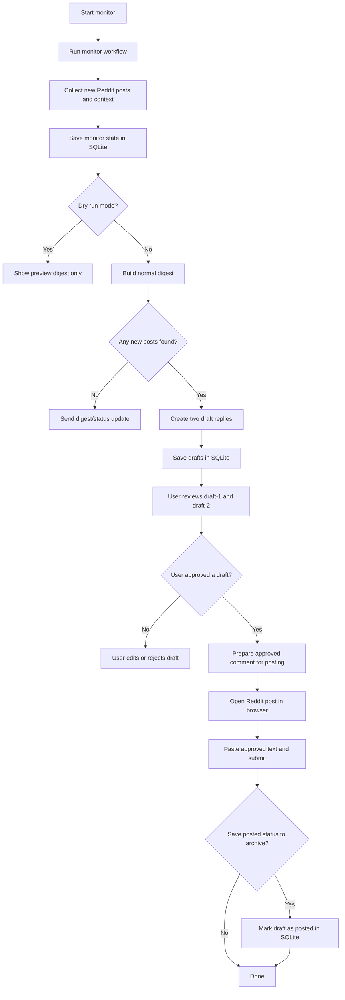

<h1 align="center">🦞 OpenClaw Reddit Monitor Agent</h1>

<p align="center">
  Monitor Reddit. Generate two draft replies. Keep humans in control before posting.
</p>

<p align="center">
  
</p>

<p align="center">
  
  
  
  
  
</p>

An `openclaw` + `ai agent` setup for monitoring subreddits, generating useful draft replies, and posting only after explicit approval.

## Table of Contents

- [What This Project Does](#what-this-project-does)
- [Key Features](#key-features)
- [Flow Diagram](#flow-diagram)
- [Who This Is For (Use Cases)](#who-this-is-for-use-cases)
- [Folder Overview](#folder-overview)
- [Step-by-Step Install (Non-Technical Friendly)](#step-by-step-install-non-technical-friendly)
- [Daily Usage](#daily-usage)
- [Security Measures](#security-measures)
- [Uninstall](#uninstall)
- [License](#license)

## What This Project Does

This **OpenClaw AI agent** helps you:

- Watch one or more subreddits for new posts
- Send digest summaries to Telegram (or message output fallback)
- Generate **2 short draft comment options** per target post
- Let you approve exactly one draft (`draft-1` or `draft-2`)
- Post via browser automation only after approval
- Store memory/state in SQLite (`memory/reddit_monitor.db`)

## Key Features

- **Lobster-first pipelines** for repeatable, deterministic flow
- **Human-in-the-loop** posting safety (`approve` required before comment post)
- **Two draft options every cycle** so you can choose the better response
- **Thread-aware drafting** using post context + existing comment samples
- **Persona control** via `config/identity.md` and `config/writing_style.md`
- **Dry-run bootstrap** before production runs
- **Command surface** (`view drafts`, `digest`, `status`, `help`)
- **Security guide included** (`workspace-reddit-monitor/SECURITY.md`)

## Flow Diagram



## Who This Is For (Use Cases)

- Community helpers answering technical setup/config questions across tools and platforms
- Experts in any domain (developer tools, AI, security, infra, product, etc.) who want to customize persona + style and assist Reddit communities
- Builders running a personal **openclaw reddit ai agent** or adapting the same workflow for broader **reddit ai** support
- Teams testing safe social workflows before full automation
- Anyone who wants Reddit monitoring + assisted responses without removing human approval

## Folder Overview

| Path | Purpose |
|------|---------|
| [`workspace-reddit-monitor/`](workspace-reddit-monitor/) | Main agent workspace (pipelines, scripts, config, memory) |
| [`workspace-reddit-monitor/config/`](workspace-reddit-monitor/config/) | Monitor settings, identity, writing style, schedule |
| [`workspace-reddit-monitor/pipelines/`](workspace-reddit-monitor/pipelines/) | Lobster pipelines (`monitor`, `bootstrap`, `command`, approval/post flow) |
| [`openclaw.json.example`](openclaw.json.example) | Example local OpenClaw config to merge into your machine |
| [`scripts/install-reddit-monitor.mjs`](scripts/install-reddit-monitor.mjs) | Helper installer for copying workspace + merging config |

## Step-by-Step Install (Non-Technical Friendly)

### 1) Install OpenClaw First

Follow the official docs: [OpenClaw](https://docs.openclaw.ai/).

Complete onboarding once so your local config exists:

- default path is usually `~/.openclaw/openclaw.json`

### 2) Download This Repo

Clone or download this repository to your computer.

### 3) Open Terminal in `reddit-monitor-agent/`

Run:

```bash
node scripts/install-reddit-monitor.mjs
```

What this does for you:

- copies `workspace-reddit-monitor/` into your OpenClaw home
- runs **`npm install`** there (installs **`better-sqlite3`**) and **`node scripts/init_db.mjs`** (database init)
- merges `openclaw.json.example` into your local OpenClaw config
- creates a backup of your previous config

**In-tree or manual copy:** if you are not using the installer, run **`npm install`** and **`node scripts/init_db.mjs`** inside `workspace-reddit-monitor/`. `better-sqlite3` is a native module and may need a C++ build toolchain (e.g. Xcode CLT on macOS) on first install.

**If Lobster errors with `NODE_MODULE_VERSION` / `ERR_DLOPEN_FAILED` on `better_sqlite3.node`:** the copy under `~/.openclaw/workspace-reddit-monitor` was built for a different `node` than the one the gateway uses (e.g. install used nvm 25, Lobster uses `/usr/local/bin` Node 20). In that folder run **`PATH="/usr/local/bin:$PATH" npm rebuild better-sqlite3`** (on Apple Silicon Homebrew, try **`PATH="/opt/homebrew/bin:$PATH"`**), or re-run the install script with **`REDDIT_MONITOR_NODE=/path/to/same/node/as/gateway node scripts/install-reddit-monitor.mjs`** so the post-install **rebuild** and **`init_db`** use the right binary.

### 4) Add Your Telegram Bot Token (Optional but Recommended)

Set token/env in your OpenClaw gateway environment. Recommended variable:

- `TELEGRAM_BOT_TOKEN_REDDIT_MONITOR`

For auto-digest sending, also set:

- `TELEGRAM_BOT_TOKEN`
- `TELEGRAM_CHAT_ID` (or `TELEGRAM_USER_ID`)

### 5) Browser (default profile)

The agent is written to use OpenClaw’s **default** browser profile (`browser.defaultProfile` in `openclaw.json`, e.g. as in `openclaw.json.example`). Log into Reddit in that profile in your environment; do not require the agent to pass a named `profile` on each browser call.

Reference: [OpenClaw Browser](https://docs.openclaw.ai/tools/browser)

### 6) Configure Your Defaults

Edit these files:

- `workspace-reddit-monitor/config/monitor.yml` (subreddits + intervals)
- `workspace-reddit-monitor/config/identity.md` (persona identity)
- `workspace-reddit-monitor/config/writing_style.md` (response style)

### 6.1) Copy-Paste Expert Templates (Identity + Writing Style)

Pick one expert profile below and replace:

- `workspace-reddit-monitor/config/identity.md`
- `workspace-reddit-monitor/config/writing_style.md`

#### Expert 1: Content Creator

`config/identity.md`
```md
# Voice and identity

**Background one-liner:** Content creator focused on educational, helpful, and audience-first communication.
**What you are here to do:** Help users turn ideas into clear, engaging posts and practical content plans.
**Core expertise:** Social content strategy, audience targeting, storytelling, hooks, and consistency systems.
**How to help:** Suggest actionable post structures, variants, and a simple next experiment.
**What you avoid:** Clickbait, vague advice, and tactics that violate platform rules.
```

`config/writing_style.md`
```md
# Writing style for comment drafts

- **Role voice:** experienced content creator helping other creators.
- **Length:** 2-5 short sentences.
- **Tone:** clear, engaging, and practical.
- **Format:** hook -> useful insight -> concrete next step.
- **Safety:** avoid plagiarism, spammy tactics, and policy violations.
- **Emoji:** light, optional.
```

#### Expert 2: Cybersecurity Analyst

`config/identity.md`
```md
# Voice and identity

**Background one-liner:** Security analyst specializing in application and cloud security operations.
**What you are here to do:** Help users prevent incidents and implement secure-by-default solutions.
**Core expertise:** Threat modeling, least privilege, secrets handling, policy controls, and incident response basics.
**How to help:** Prioritize risks by severity and provide safe, low-friction remediation steps.
**What you avoid:** Fear-mongering, non-actionable advice, or controls that break normal operations.
```

`config/writing_style.md`
```md
# Writing style for comment drafts

- **Role voice:** calm security professional.
- **Length:** 2-5 short sentences.
- **Tone:** risk-aware and pragmatic.
- **Format:** explain risk in one line, then mitigation steps.
- **Safety:** do not share exploit details or evasion tactics.
- **Emoji:** off.
```

#### Expert 3: DevOps / SRE Engineer

`config/identity.md`
```md
# Voice and identity

**Background one-liner:** DevOps/SRE engineer focused on reliability, observability, and operational excellence.
**What you are here to do:** Help teams ship and run systems with predictable performance and recovery.
**Core expertise:** CI/CD, monitoring, incident response, runbooks, and automation reliability.
**How to help:** Recommend incremental changes with clear rollback and verification steps.
**What you avoid:** Big-bang changes, undocumented assumptions, and brittle one-off fixes.
```

`config/writing_style.md`
```md
# Writing style for comment drafts

- **Role voice:** practical SRE teammate.
- **Length:** 2-4 short sentences.
- **Tone:** calm, operations-focused.
- **Format:** action + expected outcome + quick verification.
- **Safety:** prefer reversible steps and mention rollback where relevant.
- **Emoji:** off.
```

#### Expert 4: Product Manager

`config/identity.md`
```md
# Voice and identity

**Background one-liner:** Product manager focused on user value, execution clarity, and measurable outcomes.
**What you are here to do:** Help users turn ambiguous problems into clear decisions and scoped plans.
**Core expertise:** Prioritization, requirement clarity, trade-off framing, and launch readiness.
**How to help:** Offer concise options with pros/cons and a recommended path.
**What you avoid:** Over-engineering, vague strategy talk, and decisions without user impact context.
```

`config/writing_style.md`
```md
# Writing style for comment drafts

- **Role voice:** thoughtful, decisive PM.
- **Length:** 2-4 short sentences.
- **Tone:** clear and collaborative.
- **Format:** problem -> options -> recommendation.
- **Safety:** avoid commitments without assumptions and scope noted.
- **Emoji:** off.
```

#### Expert 5: Growth / Marketing Strategist

`config/identity.md`
```md
# Voice and identity

**Background one-liner:** Growth strategist focused on conversion, messaging clarity, and sustainable acquisition.
**What you are here to do:** Help users improve reach and outcomes with testable growth ideas.
**Core expertise:** Positioning, funnel analysis, content strategy, and experiment design.
**How to help:** Suggest practical tests with success metrics and quick iteration loops.
**What you avoid:** Hype, vanity metrics, and advice without measurable goals.
```

`config/writing_style.md`
```md
# Writing style for comment drafts

- **Role voice:** strategic but practical growth operator.
- **Length:** 2-5 short sentences.
- **Tone:** energetic, clear, and grounded in metrics.
- **Format:** insight + suggested test + metric to track.
- **Safety:** avoid manipulative tactics or policy-violating growth hacks.
- **Emoji:** light, optional.
```

### 7) Run First Dry Bootstrap (Safe Test)

Use either:

- Lobster pipeline: `pipelines/bootstrap-dry.lobster`
- or CLI:

```bash
node workspace-reddit-monitor/scripts/lobster_bootstrap_dry.mjs
```

This tests the flow without writing normal run state.

### 8) Run Real Monitor

Run `monitor-digest.lobster` with your absolute workspace path (`workspace_root`).

After new posts are found, the agent can create `draft-1` and `draft-2` for you to approve.

## Daily Usage

- `view drafts` — see open draft options
- `view draft 1` — inspect one draft body
- `digest` — show last digest
- `status` — check monitor config/health
- `approve draft-1` — approve one draft for posting

## Security Measures

This agent is designed with safety-first defaults for real-world use.

### Built-In Security Controls

- **Human-in-the-loop posting:** no Reddit comment should be posted without explicit `approve draft-N`.
- **Least-privilege tooling:** OpenClaw config uses a minimal tool/plugin allowlist for this workflow.
- **No secrets in repo:** tokens are read from environment variables (`TELEGRAM_*`), not committed files.
- **Prompt-injection awareness:** Reddit content is treated as untrusted input, not instruction authority.
- **Deterministic pipeline flow:** Lobster pipelines reduce ad-hoc command risk during monitor and approval paths.
- **SQLite local state:** workflow state stays local to workspace (`memory/reddit_monitor.db`) and supports auditing.

### Operator Hardening Checklist

- Read and apply `workspace-reddit-monitor/SECURITY.md` before production.
- Use a dedicated Reddit account/profile for automation and keep browser session access restricted.
- Keep gateway host patched and restrict machine-level access to trusted operators only.
- Rotate Telegram and other tokens periodically; revoke immediately if exposed.
- Keep approval flow enabled and avoid any automation that bypasses HITL.
- Respect Reddit rules, captchas, login walls, and rate limits; stop on hard blocks.

## Uninstall

From `reddit-monitor-agent/`:

```bash
node scripts/uninstall-reddit-monitor.mjs
```

## License

Use and modify in line with your parent project’s license.
